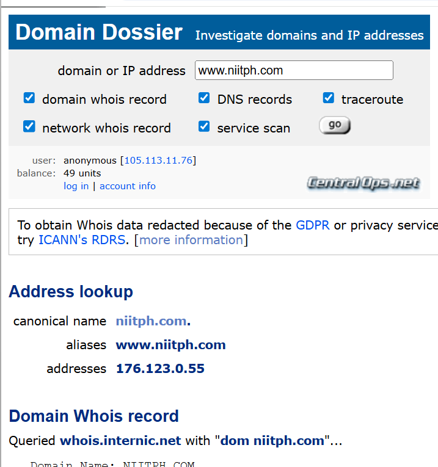
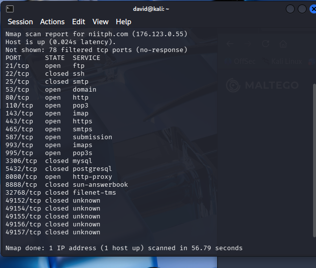
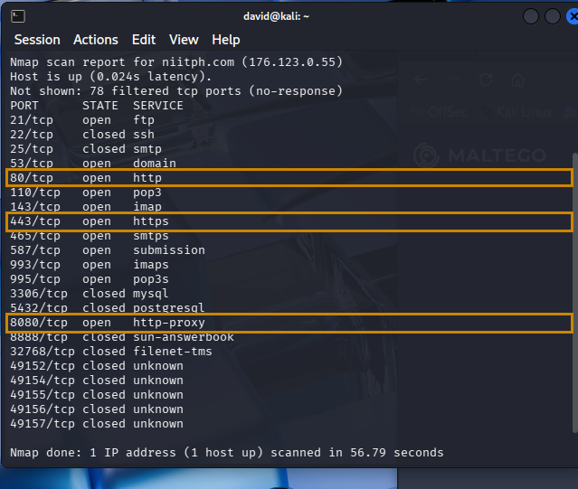
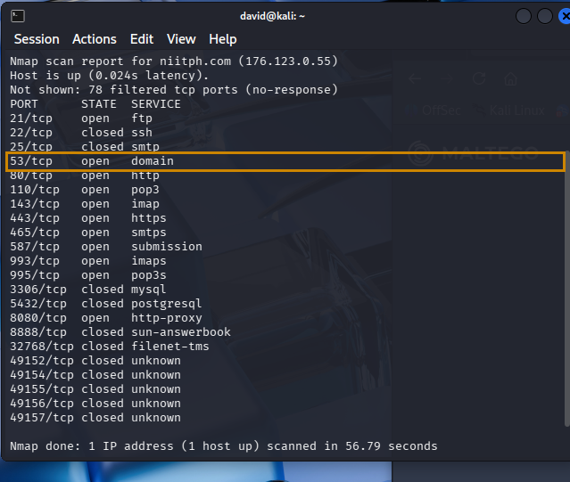
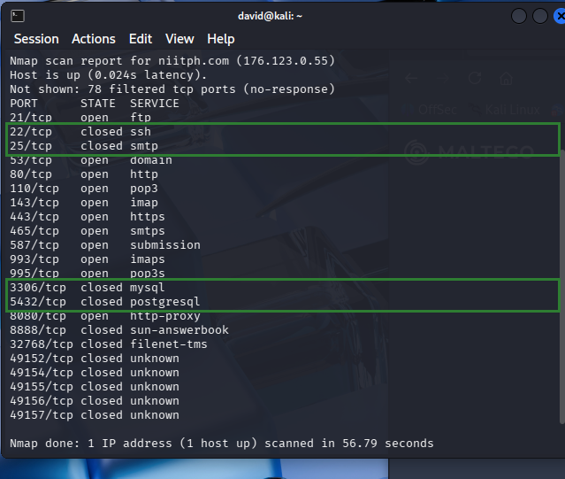

# Enterprise Threat Intelligence Assessment

*Open Source Exposure and Security Intelligence Review*

**Primary Subject of Assessment:** niitph.com

**Prepared by:** Obi David Chibuzor
**Contact:** Obiraph95@gmail.com | +234 813 472 2277
**Classification:** Not specified in source material
**Date:** Not specified in source material

## Table of Contents

1. [Introduction](#1-introduction)
2. [Overview](#2-overview)
3. [Objectives](#3-objectives)
4. [Scope](#4-scope)
5. [Tools Used](#5-tools-used)
6. [Methodology](#6-methodology)
7. [Findings](#7-findings)
8. [Intelligence Correlation](#8-intelligence-correlation)
9. [Intelligence Assessment](#9-intelligence-assessment)
10. [Risk Analysis](#10-risk-analysis)
11. [Recommendations](#11-recommendations)
12. [Reference](#12-reference)

---

## 1. Introduction

This project, titled "Enterprise Intelligence Assessment on niitph.com," focuses on evaluating the digital exposure and security posture of an enterprise system through structured intelligence analysis. It examines exposure identification, human attack surface, infrastructure accessibility, intelligence correlation, and intelligence assessment. The stated aim is to identify potential security risks, understand how information and systems are exposed, and analyze how different intelligence findings connect to reveal possible attack paths, providing insight into the organization's security weaknesses and how cyber threats could exploit available digital assets.

## 2. Overview

niitph.com is the web presence of NIIT Port Harcourt, an information technology training and skills-development institute, as identified by the organization's branding captured in the source material. The institute's public-facing profile includes a staff/faculty listing covering roles such as Data Analysis Faculty, Multimedia Faculty, Java Faculty, and Accounts, indicating an active training operation with multiple subject-area instructors.

Domain and network lookups recorded in the source material (via a CentralOps-based domain dossier query) resolve niitph.com / www.niitph.com to the IP address 176.123.0.55. The organization also publishes a direct contact channel consisting of an enquiries mailbox (niitportharcourtenquiries@gmail.com), two published phone numbers, and a physical address at No. 1 Kaduna Street, D-Line, Port Harcourt.

*Beyond the identity, contact, and domain-resolution details above, the source document did not provide further narrative (e.g., organizational history, size, or business context) under its Overview heading; no such detail has been invented here.*

## 3. Objectives

- Identify publicly available information
- Assess employee and organizational exposure
- Discover digital assets and online footprints
- Investigate publicly available infrastructure
- Correlate intelligence findings into meaningful relationships
- Assess security risk based on collected intelligence
- Produce a professional intelligence report

## 4. Scope

This assessment was limited to passive open source intelligence (OSINT) activities using publicly available information. No intrusive or unauthorized activity was performed.

## 5. Tools Used

The following tools are recorded in the source document as having been used during this assessment:

| Tool | Purpose |
|---|---|
| Google Dorking | Advanced search-operator queries against public search engines |
| Whois | Domain registration and ownership lookup |
| theHarvester | Email address and subdomain discovery |
| Wayback Machine | Historical / archived website analysis |
| Maltego | Entity relationship mapping and link analysis |
| HTTrack | Offline website mirroring |
| Shodan | Internet-facing asset and service discovery |
| OSINT Framework | Directory of domain and registration lookup resources |

*Table 1 — Tools referenced in the source material and their stated purpose.*

## 6. Methodology

The assessment followed the intelligence cycle methodology to ensure a structured and repeatable intelligence process:

- Planning
- Collection
- Processing
- Analysis
- Dissemination

*The source document names these five phases but does not provide further descriptive detail on how each phase was specifically executed; no elaboration has been added beyond what was stated.*

## 7. Findings

The findings below consolidate all evidence and observations recorded in the source material, organized by activity, with the original screenshots embedded under each finding.

### A. Individual OSINT Verification — Dr. Martha Ozohu Musa (Nwigwe University)

**Finding:** The Wayback Machine (archive.org) was used and returned archived evidence confirming that Dr. Martha Ozohu Musa was previously a lecturer at Nwigwe University.
**Risk Level:** Low — *MITRE ATT&CK: T1589.003 — Gather Victim Identity Information: Employee Names (Reconnaissance)*

*Fig. A1 — Wayback Machine archived capture confirming prior affiliation with Nwigwe University.*

### B. niitph.com — Domain, IP & Contact Exposure

**Finding:** A CentralOps-based domain dossier query resolved niitph.com / www.niitph.com to the IP address 176.123.0.55, obtained using the OSINT Framework.
**Risk Level:** High — *MITRE ATT&CK: T1590.005 — Gather Victim Network Information: IP Addresses (Reconnaissance); T1596.002 — Search Open Technical Databases: WHOIS (Reconnaissance)*

*Fig. B1 — niitph.com IP address, phone number links, and location address.*

**Finding:** The website publishes a direct contact widget: two phone numbers, an enquiries mailbox (niitportharcourtenquiries@gmail.com), and a physical address (No. 1 Kaduna Street, D-Line, Port Harcourt).
**Risk Level:** High — *MITRE ATT&CK: T1589.002 — Gather Victim Identity Information: Email Addresses (Reconnaissance); T1591.001 — Gather Victim Org Information: Determine Physical Locations (Reconnaissance)*

*Fig. B2 — Contact details widget.*

### C. niitph.com — Staff Identity & Email Exposure

**Finding:** Staff names and email links associated with niitph.com were identified using the OSINT Framework and Maltego, including staff member Ibigbari Eretoru, Chief Counsellor, whose work email address is published on a public profile. (Associated finding also enables MITRE ATT&CK T1566 — Phishing, Initial Access.)
**Risk Level:** High — *MITRE ATT&CK: T1589.002 — Email Addresses; T1589.003 — Employee Names (Reconnaissance)*

*Fig. C1 — Staff name and email exposure.*

### D. niitph.com — Social Media Presence

**Finding:** Google Dorking identified an active @niitphc Instagram account promoting the institute's programs (Software Engineering, Cybersecurity, Data Science, Digital Skills).
**Risk Level:** High — *MITRE ATT&CK: T1593.001 — Search Open Websites/Domains: Social Media (Reconnaissance)*

*Fig. D1 — Social media presence (Instagram).*

### E. niitph.com — Human Attack Surface

**Finding:** A staff member was identified as Centre Head, NIIT Port Harcourt Centre, on LinkedIn using the OSINT Framework.
**Risk Level:** High — *MITRE ATT&CK: T1589.003 — Employee Names; T1591.004 — Identify Roles (Reconnaissance)*

*Fig. E1 — Staff identified on LinkedIn.*

**Finding:** A staff member's personal Facebook profile, publicly linked to the organization, was also identified using the OSINT Framework.
**Risk Level:** High — *MITRE ATT&CK: T1593.001 — Social Media; T1589.003 — Employee Names (Reconnaissance)*

*Fig. E2 — Staff identified on Facebook.*

**Finding:** A direct review of the website's "Meet the Staff" page named faculty by role: Data Analysis Faculty, Multimedia Faculty, Java Faculty, and Accounts.
**Risk Level:** High — *MITRE ATT&CK: T1591.004 — Gather Victim Org Information: Identify Roles (Reconnaissance)*

*Fig. E3 — Staff / faculty webpage.*

### F. niitph.com — Infrastructure Accessibility

**Finding:** Nmap identified multiple open mail-related ports (110, 143, 465, 587, 993, 995) on niitph.com, indicating exposed POP3/IMAP/SMTP services that could be leveraged for credential brute-forcing or phishing infrastructure abuse.
**Risk Level:** High — *MITRE ATT&CK: T1595.002 — Active Scanning: Vulnerability Scanning (Reconnaissance) → enables T1110 Brute Force / T1566 Phishing*

*Fig. F1 — Nmap host-discovery and port-scan output for niitph.com (176.123.0.55).*

**Finding:** The same scan found web ports 80, 443, and 8080 open on niitph.com, confirming publicly accessible web services that could be targeted for exploitation of the public-facing application.
**Risk Level:** Medium — *MITRE ATT&CK: T1595.001 — Scanning IP Blocks (Reconnaissance) → enables T1190 Exploit Public-Facing Application*

*Fig. F2 — Nmap output highlighting web ports 80, 443, and 8080 open.*

**Finding:** Port 53 (DNS) was also found open on niitph.com, indicating the DNS service is reachable from the public internet and could be enumerated during reconnaissance.
**Risk Level:** Medium — *MITRE ATT&CK: T1590.002 — DNS; T1596.001 — DNS/Passive DNS (Reconnaissance)*

*Fig. F3 — Nmap output highlighting DNS port 53 open.*

**Finding:** Critical administrative and database ports — SSH 22, SMTP 25, MySQL 3306, and PostgreSQL 5432 — were confirmed closed to public access on niitph.com, reducing the exposed attack surface for these services.
**Risk Level:** Low — *MITRE ATT&CK: No offensive technique applicable — reduces attack surface*

*Fig. F4 — Nmap output highlighting ports 22, 25, 3306, 5432 closed.*

*Table 2 (source) — Consolidated findings, risk levels, and supporting evidence, reproduced above with embedded screenshots.*

*The source document's findings did not carry individual risk ratings or MITRE ATT&CK mappings; the Risk Level and MITRE ATT&CK values shown above are the analyst's own qualitative judgments, derived from the ratings assigned in Section 10 (Risk Analysis) and mapped to the closest matching Reconnaissance-tactic techniques in the MITRE ATT&CK Enterprise framework. Sections 8–10 are the analyst's synthesis of the findings documented above and do not introduce new external facts beyond what was collected during the assessment.*

## 8. Intelligence Correlation

- **Email service exposure:** multiple open email service ports (Group F) confirm the presence of an active communication system used by staff; correlated with publicly available employee information (Groups C, E), this increases the risk of phishing and credential-based attacks.
- **Web and portal exposure:** the availability of web services on ports 80, 443, and 8080 (Group F) suggests the existence of web applications or portals that may serve as entry points for attackers.
- **DNS exposure:** the presence of an open DNS service (Group F) further expands the attack surface by enabling subdomain discovery.
- **Human and technical convergence:** the correlation of human intelligence (Groups B, C, D, E) and technical intelligence (Group F) indicates that both system-level vulnerabilities and human factors contribute significantly to the organization's exposure — attackers do not rely on a single vulnerability but combine multiple intelligence sources to identify and exploit weak points.

## 9. Intelligence Assessment

The intelligence assessment of niitph.com indicates that the organization maintains basic operational infrastructure, including web and email services. The presence of multiple exposed email service ports significantly increases the risk of phishing and credential-based attacks, particularly when combined with the human attack surface. Web services running on ports 80, 443, and 8080 further contribute to potential vulnerabilities, especially if misconfigurations exist. While critical services such as database and remote access ports are not publicly exposed, the overall attack surface remains considerable due to the combination of technical exposure and human factors.

## 10. Risk Analysis

Risk levels below are qualitative judgments assigned by the analyst using a likelihood-and-impact scale (High / Medium / Low), applied strictly to the findings already documented in Section 7 and the correlation and assessment narratives in Sections 8–9; the source material supplied no ratings of its own, so none is asserted beyond what follows.

- **High** — Exposed mail service ports (110, 143, 465, 587, 993, 995) (Group F): source states email services are targets for phishing/brute-force, and correlation notes this combines with exposed staff emails to raise credential-attack risk.
- **High** — Human attack surface: public staff names, roles, emails, phone numbers, and social profiles (Groups B, C, D, E): source assesses this as increasing phishing and impersonation risk.
- **Medium** — Web services on ports 80/443 with proxy service on 8080 (Group F): source notes port 8080 in particular can be risky if misconfigured, and flags web vulnerabilities if unpatched.
- **Medium** — DNS service exposure on port 53 (Group F): source states this enables DNS enumeration and, per correlation, subdomain discovery.
- **Low** — Critical services (SSH 22, SMTP 25, MySQL 3306, PostgreSQL 5432) (Group F): all four confirmed closed to public access; source characterizes this as good security practice.

## 11. Recommendations

Based on the findings of this enterprise intelligence assessment, the source material puts forward the following recommendations:

- Strengthen email security by implementing spam filters, multi-factor authentication (MFA), and regular staff awareness training to prevent phishing attacks.
- Properly configure and regularly update web services running on ports 80, 443, and 8080 to prevent exploitation of vulnerabilities.
- Close unnecessary services and ports to minimize the organization's exposure.
- Protect email systems as a high priority, secure the website, close unused ports, train staff, and monitor systems on an ongoing basis.

*The source material does not assign owners, timelines, or priority sequencing to these recommendations, nor does it provide a completed risk matrix to weight them against; these elements are not fabricated here and would need to be defined by the organization.*

## 12. Reference

The following tools and sources were used or referenced during this assessment:

- Google Hacking Database (GHDB) / Google Dorking — exploit-db.com
- CentralOps Domain Dossier (Whois / DNS / network lookup) — centralops.net
- theHarvester — laramies/theHarvester, GitHub
- Wayback Machine — web.archive.org
- Maltego — maltego.com
- HTTrack Website Copier — httrack.com
- Shodan — shodan.io
- OSINT Framework — created by Justin Nordine, osintframework.com
- Nmap Security Scanner — nmap.org

*No academic, government, or industry literature was cited in the source document, and none has been added beyond the tool/methodology sources above.*
